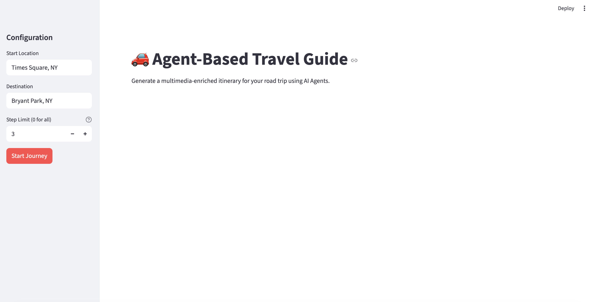
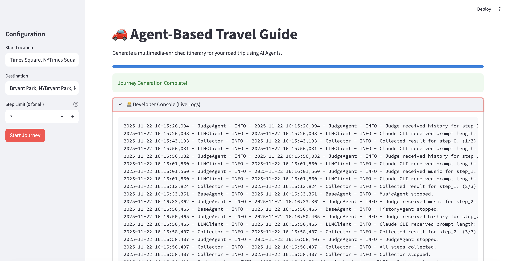
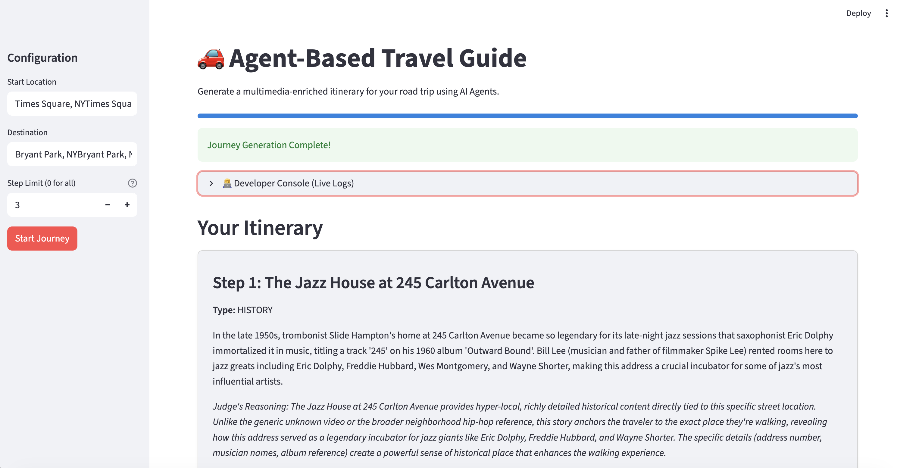

# 🚗 Agent-Based Travel Guide

A sophisticated multi-agent system that generates a travel itinerary enriched with multimedia content (YouTube videos, Music, History) for each step of a driving route. This project demonstrates the power of **Autonomous AI Agents** working in concert to enhance a user's journey.

## 🌟 Features

*   **Zero-Cost Architecture**: Built entirely using free-tier APIs (OpenRouteService for mapping, Brave Search for content) to ensure accessibility.
*   **Multi-Agent Orchestration**:
    *   **YouTube Agent**: Scours the web for the most relevant travel vlogs or drone footage.
    *   **Music Agent**: Curates songs that match the vibe, culture, or history of the location.
    *   **History Agent**: Unearths fascinating historical facts and stories.
    *   **Judge Agent**: Evaluates all candidates and selects the single best piece of content for each step.
*   **Interactive Streamlit UI**: A modern web interface with:
    *   Real-time progress tracking.
    *   **Developer Console**: A live view of the agents' internal reasoning and logs ("What's happening behind the scenes").
    *   Beautiful card-based itinerary display.
*   **Claude CLI Integration**: Leverages the `claude` CLI in headless mode for all agent reasoning, ensuring high-quality outputs.
*   **Concurrency**: All agents run in parallel threads for efficient processing.


## 📸 Screenshots

### 1. Empty State & Configuration
*The clean starting interface where users input their journey details.*


### 2. Developer Console (Live Debugging)
*Real-time logs showing the agents searching, reasoning, and making decisions.*


### 3. Generated Itinerary
*The final result: a curated list of multimedia content for every step of the trip.*


## 🚀 Setup & Installation

### Prerequisites
*   **Python 3.8+**
*   **uv** (Recommended for dependency management) or `pip`.
*   **Claude CLI**: Installed and authenticated (`claude login`).
*   **API Keys**:
    *   `ORS_API_KEY`: OpenRouteService (Free).
    *   `BRAVE_SEARCH_API_KEY`: Brave Search API (Free).

### Installation

1.  **Clone the repository**:
    ```bash
    git clone <repository-url>
    cd llm_agents/hw4
    ```

2.  **Install dependencies**:
    ```bash
    uv venv
    source .venv/bin/activate
    uv pip install -r requirements.txt
    ```

3.  **Configure Environment**:
    Create a `.env` file in the root directory:
    ```bash
    cp .env.example .env
    ```
    Edit `.env` and add your keys:
    ```ini
    ORS_API_KEY=your_ors_key
    BRAVE_SEARCH_API_KEY=your_brave_key
    # LLM_API_KEY is optional if Claude CLI is already authenticated globally
    ```

## 🎮 Usage

### Option 1: Streamlit UI (Recommended)
Run the interactive web application:
```bash
uv run streamlit run app.py
```
*If you encounter port issues, let the system assign a free port:*
```bash
uv run streamlit run app.py --server.port 0
```

### Option 2: CLI Mode
Run the system directly from the terminal:
```bash
uv run main.py "Times Square, NY" "Bryant Park, NY" --limit 5
```

## 📂 Project Structure

*   **`app.py`**: Streamlit UI entry point.
*   **`main.py`**: CLI entry point.
*   **`core/`**: Core logic (Engine, Mapper, Scheduler, Orchestrator, Collector).
*   **`agents/`**: Agent implementations (Base, Content, Judge) and prompt templates.
*   **`utils/`**: Helper clients (BraveSearch, ClaudeCLI, Logger).
*   **`models/`**: Data classes (RouteStep, ContentCandidate).

## 🧠 How It Works

1.  **Route Finding**: The system fetches driving directions from OpenRouteService.
2.  **Scheduling**: Each step of the route is converted into a task.
3.  **Agent Execution**: For each step, three specialized agents (YouTube, Music, History) use **Brave Search** to find relevant content and **Claude** to refine it.
4.  **Judging**: The Judge Agent evaluates the three candidates and picks the most interesting one for that specific location.
5.  **Collection**: Results are aggregated and presented to the user.
