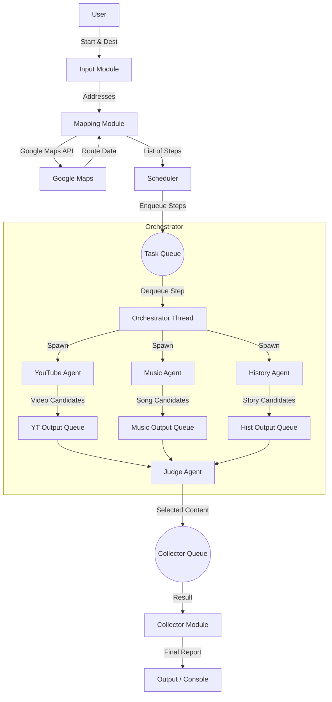

# Design Document: Agent-Based Travel Guide

## 1. System Overview

The **Agent-Based Travel Guide** is a concurrent, multi-agent system that enriches driving routes with location-specific multimedia content. It orchestrates multiple LLM-powered agents to analyze route steps in parallel and select the best accompanying content (video, music, or story) for each segment of the journey.

## 2. Architecture Diagram



## 3. Component Design

### 3.1 Input Module
*   **Responsibility**: Interface with the user to collect trip details.
*   **Inputs**: Start Address (string), Destination Address (string).
*   **Validation**: Basic non-empty string checks.
*   **Output**: Passes validated addresses to the Mapping Module.

### 3.2 Mapping Module
*   **Responsibility**: Interact with Google Maps Directions API to generate the route.
*   **Key Class**: `RouteFinder`
*   **Methods**:
    *   `get_route(start, end)`: Fetches JSON from Google Maps.
    *   `parse_route(route_json)`: Extracts individual steps.
*   **Data Structure (RouteStep)**:
    *   `step_id`: UUID
    *   `instruction`: "Turn right onto Main St"
    *   `location`: Lat/Long or address string
    *   `duration`: Estimated time
    *   `distance`: Distance of the segment
*   **Caching**: Uses a local file-based cache or in-memory dictionary to store API responses for identical (Start, End) pairs to save quota.

### 3.3 Scheduler
*   **Responsibility**: Manage the flow of work.
*   **Mechanism**: Pushes `RouteStep` objects into a thread-safe `TaskQueue`.
*   **Concurrency**: Single producer (Mapping Module) -> `TaskQueue`.

### 3.4 Orchestrator
*   **Responsibility**: Manage agent lifecycle for each step.
*   **Mechanism**:
    *   Consumes from `TaskQueue`.
    *   For each step, spawns a "Processing Group" consisting of the 3 Content Agents and 1 Judge Agent.
    *   Since we need to process multiple steps, the Orchestrator manages a pool of worker threads or simply loops through steps launching parallel agent sets. *Design Decision: Use a ThreadPoolExecutor or similar to handle multiple steps concurrently if desired, or process steps sequentially but agents in parallel. Requirement implies agents run in parallel for a step.*

### 3.5 Agents (The "Workers")
All agents inherit from a base `BaseAgent` class.

#### 3.5.1 BaseAgent
*   **Attributes**: `input_queue`, `output_queue`, `llm_client`, `search_client`.
*   **Methods**: `run()`, `process(data)`.
*   **Prompt Management**: Loads agent-specific prompts from `agents/prompts/<agent_name>.md`.

#### 3.5.2 Content Agents
1.  **YouTube Agent**:
    *   **Role**: Find relevant videos.
    *   **Logic**:
        1.  Generate search query using LLM (Claude CLI).
        2.  Search **Brave Search API** (Videos).
        3.  Pass search results to LLM (Claude CLI) to select the best video.
    *   **Output**: `ContentCandidate`.
2.  **Music Agent**:
    *   **Role**: Find relevant songs.
    *   **Logic**:
        1.  Generate search query (e.g., "songs about [Location]") using LLM.
        2.  Search **Brave Search API**.
        3.  Select best song using LLM.
    *   **Output**: `ContentCandidate`.
3.  **History Agent**:
    *   **Role**: Find historical facts.
    *   **Logic**:
        1.  Generate search query using LLM.
        2.  Search **Brave Search API**.
        3.  Summarize/Select fact using LLM.
    *   **Output**: `ContentCandidate`.

#### 3.5.3 Judge Agent
*   **Role**: Select the single best piece of content for the step.
*   **Inputs**: Reads from the output queues of the 3 Content Agents.
*   **Logic**:
    *   Waits for all 3 agents to report.
    *   Constructs a prompt with the 3 options.
    *   Calls **Claude CLI** to evaluate and pick the winner.
*   **Output**: `SelectedContent` object pushed to `CollectorQueue`.

### 3.6 Collector
*   **Responsibility**: Aggregate results and present the final itinerary.
*   **Mechanism**:
    *   Runs as a background thread/process.
    *   Continuously reads from `CollectorQueue`.
    *   Stores results in a list/dict keyed by `step_id`.
    *   Once all steps are processed (detected via a sentinel value or count), it generates the final report.

## 4. Data Structures

### 4.1 RouteStep
```python
@dataclass
class RouteStep:
    id: str
    instruction: str
    distance: str
    duration: str
    start_location: dict  # {lat, lng}
    end_location: dict    # {lat, lng}
    html_instructions: str
```

### 4.2 ContentCandidate
```python
@dataclass
class ContentCandidate:
    type: str  # "video", "music", "history"
    title: str
    description: str
    url: str  # Optional
    reasoning: str
```

### 4.3 SelectedContent
```python
@dataclass
class SelectedContent:
    step_id: str
    chosen_candidate: ContentCandidate
    judge_reasoning: str
```

## 5. Concurrency Model

*   **Threading**: Python `threading` module.
*   **Queues**: `queue.Queue` (thread-safe).
*   **Synchronization**:
    *   The Judge needs to synchronize the 3 agents.
    *   *Pattern*: The Judge thread can simply perform blocking `get()` calls on the specific queues for that step's agents.
    *   *Alternative*: Use a `Barrier` if agents share a single output queue, but dedicated queues per agent-type per step (or passed in the task) is cleaner.

## 6. External Interfaces

### 6.1 Mapping API (OpenRouteService)
*   **Endpoint**: `https://api.openrouteservice.org/v2/directions/driving-car`
*   **Key**: Loaded from environment variable `ORS_API_KEY`.

### 6.2 Search API (Brave Search)
*   **Endpoint**: `https://api.search.brave.com/res/v1/web` (and `/videos`)
*   **Key**: Loaded from environment variable `BRAVE_SEARCH_API_KEY`.

### 6.3 LLM Interface (Claude CLI)
*   **Tool**: `claude` command line interface.
*   **Usage**:
    *   Python constructs a prompt string (loading from `.md` files).
    *   Python executes `claude "prompt"` via `subprocess`.
    *   Python captures `stdout` as the response.

## 7. Caching Strategy

*   **Location Cache**:
    *   Key: `(latitude, longitude)` or `place_id`.
    *   Value: Previously generated History/Music/Video suggestions.
    *   Storage: `cache/location_cache.json`.
*   **Route Cache**:
    *   Key: `(origin, destination)`.
    *   Value: Full JSON response from ORS.
    *   Storage: `cache/route_cache.json`.
*   **Search Cache**:
    *   Key: `query`.
    *   Value: Brave Search results.
    *   Storage: `cache/search_cache.json`.

## 8. Error Handling

*   **API Failures**: Retry logic with exponential backoff for Google Maps and LLM calls.
*   **Agent Failures**: If an agent fails or times out, the Judge should proceed with the remaining agents' outputs (graceful degradation).
*   **Empty Routes**: Validate route existence before starting scheduler.

## 9. Package Structure

```text
travel_guide/
├── __init__.py
├── main.py              # Entry point
├── config.py            # Configuration (API keys)
├── models/
│   ├── __init__.py
│   ├── step.py
│   └── content.py
├── agents/
│   ├── __init__.py
│   ├── base_agent.py
│   ├── content_agents.py
│   └── judge_agent.py
├── core/
│   ├── __init__.py
│   ├── mapper.py        # Google Maps integration
│   ├── scheduler.py
│   ├── orchestrator.py
│   └── collector.py
├── utils/
│   ├── __init__.py
│   ├── llm_client.py
│   └── logger.py
└── cache/               # JSON cache files
```
